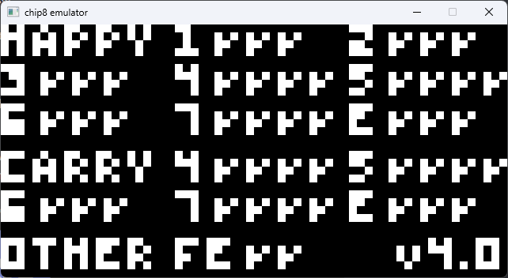

# This is just an other Chip-8 Emulator
## Still in development

- In progress...

Sources: 
- https://tobiasvl.github.io/blog/write-a-chip-8-emulator/
- https://en.wikipedia.org/wiki/CHIP-8
- https://youtu.be/jWpbHC6DtnU
- https://youtu.be/NLKQEOgBAnw
- https://www.instructables.com/CHIP-8-Computer/
- https://github.com/corax89/chip8-test-rom
- http://www.cs.columbia.edu/~sedwards/classes/2016/4840-spring/reports/Chip8.pdf
- https://www.includehelp.com/rust/reverse-bits-of-a-binary-number.aspx
- https://github.com/trapexit/chip-8_documentation